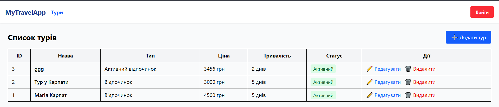
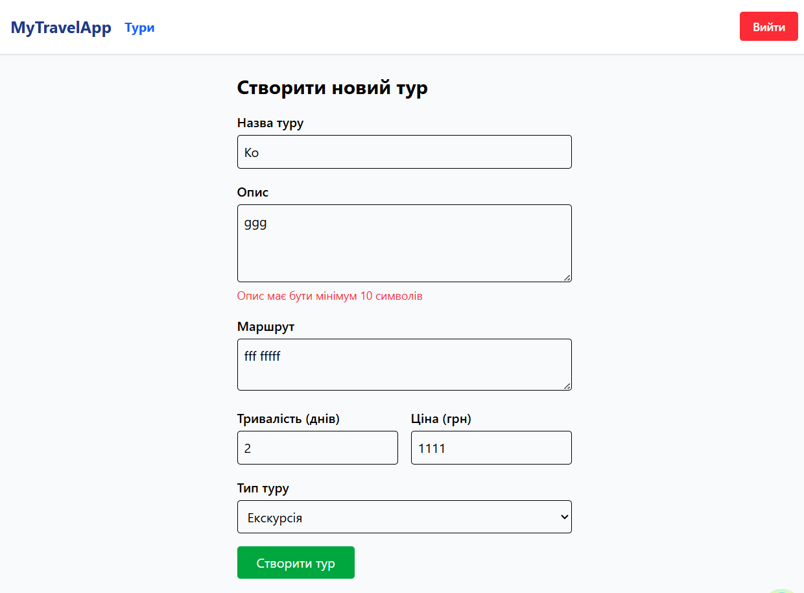
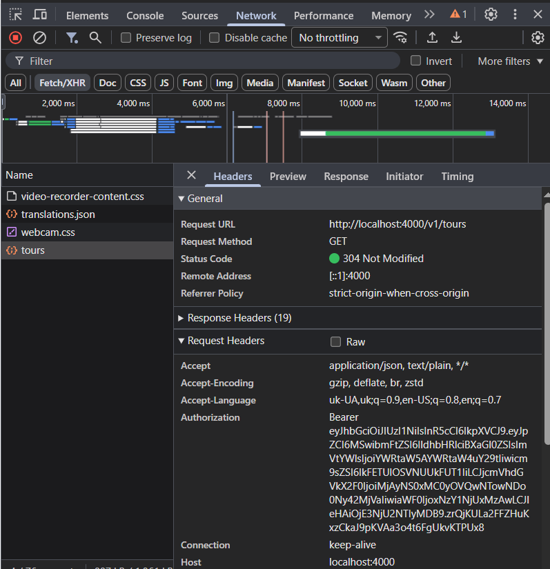

# Лабораторна робота №8
## «Full-stack інтеграція: розробка UI для Туристичної агенції»
## 1. Короткий опис реалізованого функціоналу

У рамках роботи було реалізовано клієнтську частину (Frontend) для взаємодії з REST API туристичної агенції. Реалізовано два основні модулі:

### **Модуль "Тури" (Tours)"**
- Перегляд каталогу турів  
- Створення нового туру  
- Редагування інформації про тур
- Видалення туру
- Валідація даних форми через Zod
- Кешування та синхронізація даних через TanStack Query

### **Модуль "Дати турів" (Tour Dates)"**
- Перегляд доступних дат для конкретного туру
- Додавання нових дат виїздів
- Редагування кількості вільних місць
- Видалення скасованих дат
- Зв'язок із сутністю "Тур" через ID

##  2. Приклади ключового коду

### **Конфігурація Axios**
Налаштування базового клієнта для HTTP-запитів з автоматичним додаванням токена авторизації.
```
import type { AxiosError, InternalAxiosRequestConfig } from "axios";
import axios from "axios";
import { useAuthStore } from "@/store/useAuthStore";

const apiClient = axios.create({
  baseURL: String(import.meta.env["VITE_API_BASE_URL"]),
  headers: {
    "Content-Type": "application/json",
  },
});

// 1. Request Interceptor
apiClient.interceptors.request.use(
  (config: InternalAxiosRequestConfig) => {
    const token = useAuthStore.getState().token;

    if (token) {
      config.headers.Authorization = token;
    }

    return config;
  },
  (error) => Promise.reject(error)
);

// 2. Response Interceptor (без змін)
apiClient.interceptors.response.use(
  (response) => response,
  (error: unknown) => {
    const axiosError = error as AxiosError<{ message?: string }>;
    
    if (axiosError.response?.status === 401) {
      useAuthStore.getState().logout();
    }

    const status = axiosError.response?.status;
    const message =
      axiosError.response?.data?.message ??
      axiosError.message ??
      "Unknown API error";

    console.error("API ERROR:", { status, message });

    return Promise.reject(axiosError);
  }
);

export default apiClient;
```
### **Хуки для TanStack Query**
Приклад реалізації CRUD-операцій для сутності Тури (/tours).
```
import {
  useQuery,
  useMutation,
  useQueryClient,
  type UseQueryResult,
  type UseMutationResult,
} from "@tanstack/react-query";
import apiClient from "@/lib/axios";
import type { Tour, CreateTourDto, UpdateTourDto } from "../types/tour.types";

export const getTours = async (): Promise<Array<Tour>> => {
  const response = await apiClient.get("/tours");
  return response.data as Array<Tour>;
};

export const getTourById = async (id: string): Promise<Tour> => {
  const response = await apiClient.get(`/tours/${id}`);
  return response.data as Tour;
};

export const createTour = async (payload: CreateTourDto): Promise<Tour> => {
  const response = await apiClient.post("/tours", payload);
  return response.data as Tour;
};

export const updateTour = async ({
  id,
  data,
}: {
  id: string;
  data: UpdateTourDto;
}): Promise<Tour> => {
  const response = await apiClient.patch(`/tours/${id}`, data);
  return response.data as Tour;
};

export const deleteTour = async (id: string): Promise<void> => {
  await apiClient.delete(`/tours/${id}`);
};

export const useTours = (): UseQueryResult<Array<Tour>> =>
  useQuery({
    queryKey: ["tours"], // Унікальний ключ для кешування
    queryFn: getTours,
  });

export const useTour = (id: string): UseQueryResult<Tour> =>
  useQuery({
    queryKey: ["tours", id],
    queryFn: () => getTourById(id),
    enabled: Boolean(id), // Запит піде тільки якщо є ID
  });

export const useCreateTour = (): UseMutationResult<Tour, unknown, CreateTourDto> => {
  const queryClient = useQueryClient();
  return useMutation({
    mutationFn: createTour,
    onSuccess: () => {
      void queryClient.invalidateQueries({ queryKey: ["tours"] });
    },
  });
};

export const useUpdateTour = (): UseMutationResult<
  Tour,
  unknown,
  { id: string; data: UpdateTourDto }
> => {
  const queryClient = useQueryClient();
  return useMutation({
    mutationFn: updateTour,
    onSuccess: (updated) => {
      void queryClient.invalidateQueries({ queryKey: ["tours"] });
      void queryClient.setQueryData(["tours", String(updated.id)], updated);
    },
  });
};

export const useDeleteTour = (): UseMutationResult<void, unknown, string> => {
  const queryClient = useQueryClient();
  return useMutation({
    mutationFn: deleteTour,
    onSuccess: () => {
      void queryClient.invalidateQueries({ queryKey: ["tours"] });
    },
  });
};
```
### **Zod-схема**
```
import { zodResolver } from "@hookform/resolvers/zod";
import { useForm, type SubmitHandler, type Resolver } from "react-hook-form";
import { z } from "zod";
import { useCreateTour } from "../api/tour.api";
import { useNavigate } from "@tanstack/react-router";
import type { JSX } from "react";
import { TourType, TourStatus } from "../types/tour.types";

// Схема валідації
const TourCreateSchema = z.object({
  tourName: z.string().min(1, "Введіть назву туру"),
  description: z.string().min(10, "Опис має бути мінімум 10 символів"),
  route: z.string().min(5, "Вкажіть маршрут (мінімум 5 символів)"), 
  duration: z.coerce.number().min(1, "Тривалість має бути хоча б 1 день"),
  baseCost: z.coerce.number().min(0, "Ціна не може бути від'ємною"),
  tourType: z.nativeEnum(TourType),
});

type TourCreateForm = z.infer<typeof TourCreateSchema>;

export function TourCreatePage(): JSX.Element {
  const navigate = useNavigate();
  const createTourMutation = useCreateTour();

  const {
    register,
    handleSubmit,
    formState: { errors, isSubmitting },
  } = useForm<TourCreateForm>({
    resolver: zodResolver(TourCreateSchema) as Resolver<TourCreateForm>,
    defaultValues: {
      tourType: TourType.Recreation,
    }
  });

  const onSubmit: SubmitHandler<TourCreateForm> = async (data) => {
    try {
      await createTourMutation.mutateAsync({
        ...data,
        status: TourStatus.Active 
      });
      
      alert("Тур успішно створено!");
      void navigate({ to: "/tours" });
      
    } catch (error: any) {
      console.error("Помилка:", error);
      const serverMessage = error?.response?.data?.message || "Невідома помилка";
      const errorMessage = error?.response?.data?.errorMessage || "";
      alert(`Помилка сервера: ${serverMessage}\n${errorMessage}`);
    }
  };

  return (
    <div className="p-6 max-w-xl mx-auto space-y-4">
      <h1 className="text-2xl font-bold">Створити новий тур</h1>

      <form className="space-y-4" onSubmit={handleSubmit(onSubmit)}>
        {/* Назва */}
        <div>
          <label className="block font-medium mb-1">Назва туру</label>
          <input className="border p-2 w-full rounded" {...register("tourName")} />
          {errors.tourName && <p className="text-red-500 text-sm">{errors.tourName.message}</p>}
        </div>

        {/* Опис */}
        <div>
          <label className="block font-medium mb-1">Опис</label>
          <textarea className="border p-2 w-full rounded h-24" {...register("description")} />
          {errors.description && <p className="text-red-500 text-sm">{errors.description.message}</p>}
        </div>

        {/* Маршрут (НОВЕ ПОЛЕ) */}
        <div>
          <label className="block font-medium mb-1">Маршрут</label>
          <textarea 
            className="border p-2 w-full rounded h-16" 
            placeholder="Наприклад: Київ - Львів - Карпати"
            {...register("route")} 
          />
          {errors.route && <p className="text-red-500 text-sm">{errors.route.message}</p>}
        </div>

        <div className="grid grid-cols-2 gap-4">
          {/* Тривалість */}
          <div>
            <label className="block font-medium mb-1">Тривалість (днів)</label>
            <input type="number" className="border p-2 w-full rounded" {...register("duration")} />
            {errors.duration && <p className="text-red-500 text-sm">{errors.duration.message}</p>}
          </div>

          {/* Ціна */}
          <div>
            <label className="block font-medium mb-1">Ціна (грн)</label>
            <input type="number" className="border p-2 w-full rounded" {...register("baseCost")} />
            {errors.baseCost && <p className="text-red-500 text-sm">{errors.baseCost.message}</p>}
          </div>
        </div>

        {/* Тип туру */}
        <div>
          <label className="block font-medium mb-1">Тип туру</label>
          <select className="border p-2 w-full rounded" {...register("tourType")}>
            {Object.values(TourType).map((type) => (
              <option key={type} value={type}>
                {type}
              </option>
            ))}
          </select>
          {errors.tourType && <p className="text-red-500 text-sm">{errors.tourType.message}</p>}
        </div>

        <button
          className="bg-green-600 text-white px-6 py-2 rounded hover:bg-green-700 disabled:opacity-50"
          disabled={isSubmitting}
          type="submit"
        >
          {isSubmitting ? "Збереження..." : "Створити тур"}
        </button>
      </form>
    </div>
  );
}
```
## Скріншоти
### Сторінка зі списком Турів

### Форма створення туру з помилками валідації

### Вкладка Network (DevTools)


## Коментарі щодо особливостей реалізації та труднощів
### Під час виконання роботи успішно реалізовано повний цикл CRUD-операцій для сутностей "Тури" та "Дати турів". Було налаштовано взаємодію клієнтської частини з Node.js бекендом за допомогою бібліотеки Axios.
### Особливу увагу приділено валідації даних: використання бібліотеки Zod дозволило уникнути відправки некоректних даних на сервер, що зменшує навантаження на API.